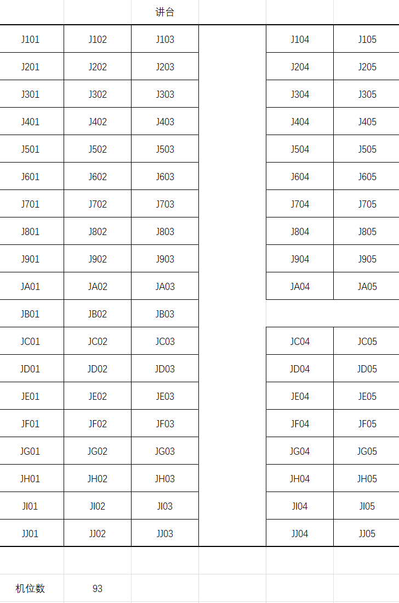
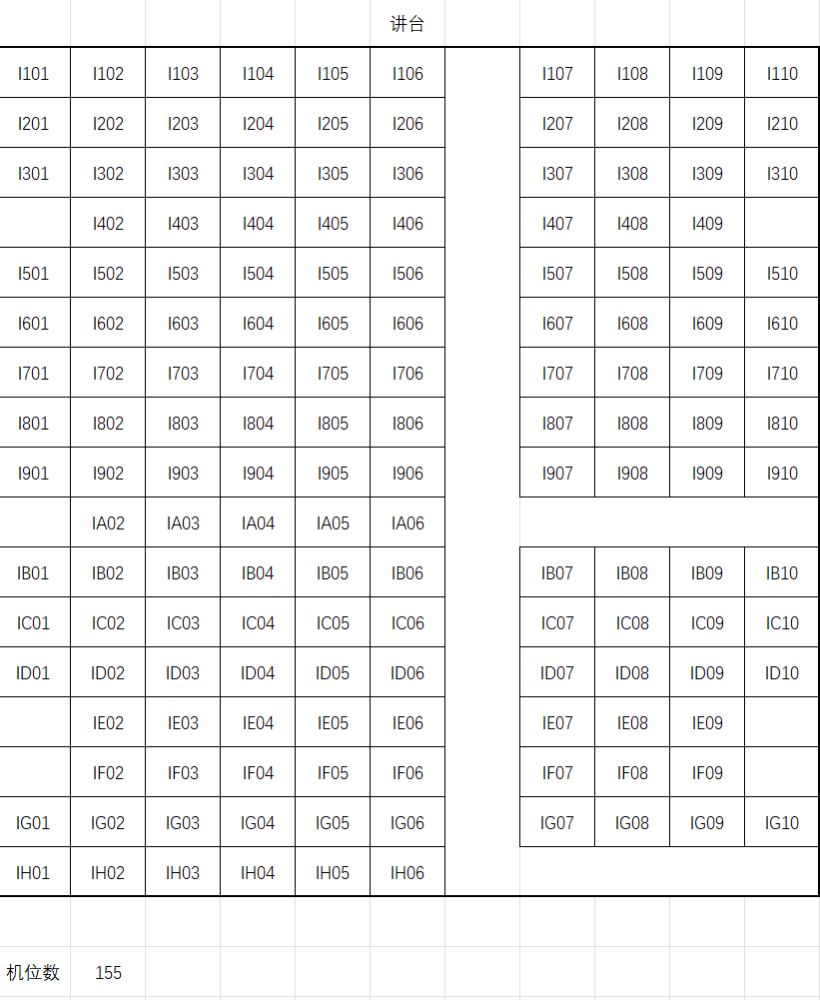
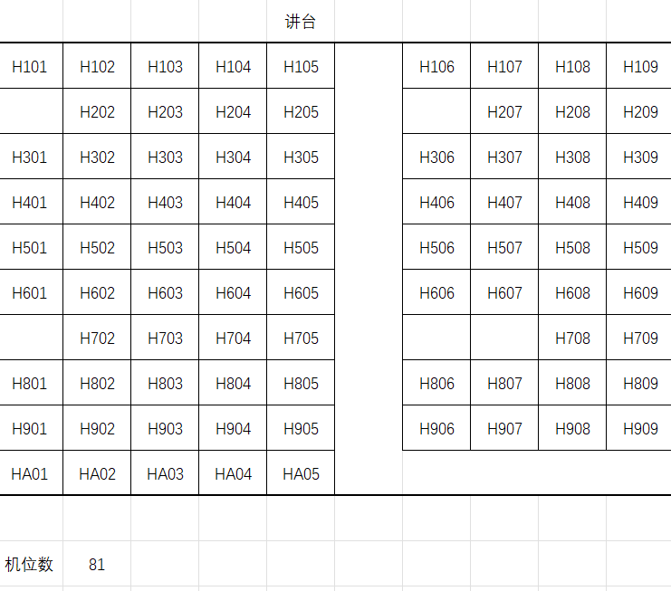
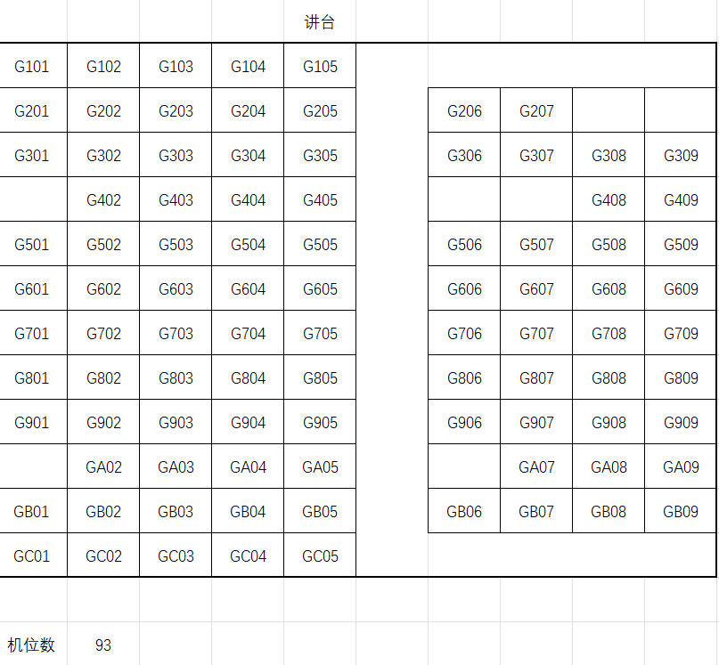
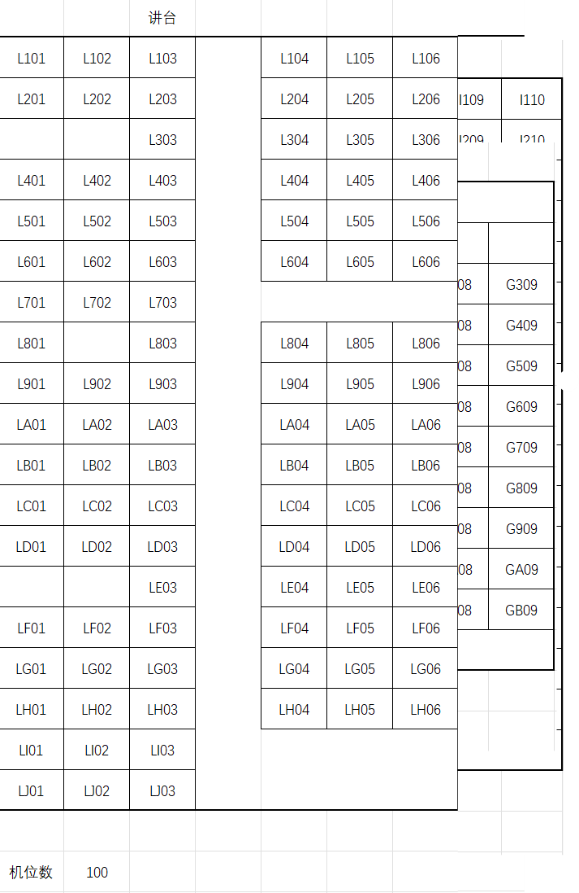
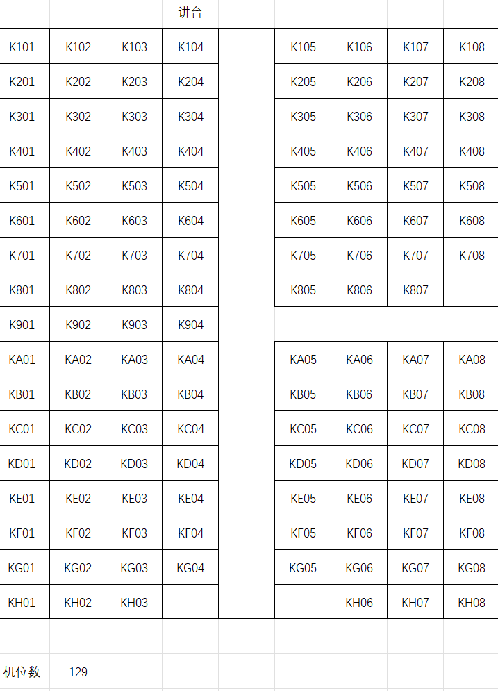

# 期末机试须知

<small>最后更新于 {docsify-updated}。</small>

## 考场分布与座位安排

考场均位于**鼓楼校区**：

- **蒙民伟楼 6 楼** 共 206 个机位，共安排 171 位同学，均为软院正选学生；
- **南园综合楼 4 楼** 共 651 个机位，共安排 566 位同学，为技科全体学生与部分跨选学生；
- **南园综合楼 5 楼** 共 90 个机位，共安排 77 位同学，为剩余的软院正选、重修、补修、跨选学生。

点击👉[该链接](https://table.nju.edu.cn/dtable/universal-app/links/a660a7df6fe24e858fee)👈查看你的考场机位，每个考场都预留了 10% 及以上的备用机位，若遇到电脑无法正常开机、环境错误等异常情况，请举手告知监考老师，老师会为你安排备用机位，不可私自更换机位！

请同学们 **至少提前 40 分钟** 抵达考场（即 2 月 19 日 13:20 之前抵达考场），找到自己的机位，并等待监考老师分发密码条。在拿到自己的密码条后，即可开机进入考试准备阶段。

以下为南园综合楼 4楼考场的机位分布：

<!-- tabs:start -->

## **402**

## **403**

## **409**

## **411**

## **413**

## **414**

<!-- tabs:end -->

## 电脑环境、框架与操作

请同学们在考试开始之前的 20 分钟内熟悉考试电脑与环境，每台电脑开机应会**默认选择考试系统**，不要自己更换系统，若进错系统（即桌面图标与下图不一致），可自行重启解决。

可以携带笔，不可携带任何纸质材料，监考老师会统一发放草稿纸。不可携带键盘、鼠标等外设。

可以携带食品，在漫长的3小时中补充能量，但不可携带有气味的、干脆的零食影响其他同学。

**任何情况下均不允许登录校外网！不允许携带任何存储设备及通讯设备！**否则将判为考试作弊。

由于电脑性能原因，第一次打开 IDE 时**可能会卡顿**，一般在十分钟后会流畅，故请提前打开所需 IDE 进行考试准备。

在正确的考试系统中，你应该能在**桌面**上看到以下图标（顺序不一定相同）：

对各图标的解释：

1. **Exam** 文件夹中为提供的代码框架：
   1. 使用 VSC 与 CLion 的同学可以直接在文件夹内右击，选择对应方式打开当前文件夹；
   2. 使用 VS 的同学需打开 `2022-CPL-Exam-VS` 文件夹，找到其中的 `.sln`文件打开；
   3. 使用 Dev-C++ 的同学请自便。

2. **Reference** 文件夹中为提供的本地文档：
   1. C 语言程序设计现代方法 第二版（非修订版），即教材电子版；
   2. C-Reference-Offline，即 C 语言手册离线版，点击快捷方式即可打开，不需要打开 `c-reference-offline-config` 文件夹；
   3. The Standard C Library，即 C 语言库函数手册；
   4. 可点击👉[该链接](https://box.nju.edu.cn/f/2fa35ea77a9c4a9aa18b/)👈下载该文件夹，先行熟悉与复习。

3. 考试 OJ 的链接文件，点击即进入 OJ 网页，除了账号密码，其余与平时 OJ 操作方式一致，记得在提交前**选择语言**，别在考试时问“为什么我按不了提交”。

4. 提供的各种 IDE：

<!-- tabs:start -->

### **Visual Studio Code**

版本为 1.75.0，配备了 Mingw（gcc 12.1.0 + llvm 14.0.6）作为 C 语言环境。

已开启**自动保存**与**保存时格式化**（默认格式，左大括号会换行）。

安装了以下插件：

其中，

- Vim 插件默认关闭，需要的同学请自行启用；
- Code Runner 已开启 "run in terminal" 选项，已配置好调试选项（仅代码框架文件夹内）
- 第一次启动软件时，可能无法使用部分插件，等待几分钟即可；
- 其余均默认。

打开代码框架文件夹后的预览效果：

### **CLion**

版本为 2022.3.2，使用其自带的 Mingw 环境，已激活。

已开启**保存时格式化**（默认格式，左大括号不换行）。

在代码框架文件夹中，`CMakelists` 已经帮你写好，做不同的题目时记得右上角更改所运行的代码。

安装了以下插件：

其中，IdeaVim 插件默认关闭，需要的同学请自行启用。

打开代码框架文件夹后的预览效果：

### **Visual Studio 2022**

仅安装了必要的 C 语言模块，其余设置均为默认。

在代码框架的 VS 项目（即 `2022-CPL-Exam-VS` 文件夹中的 `.sln`文件）中，已配置 “关闭安全警告” 预处理器，即可以直接使用 `scanf` 与 `printf`等。

打开代码框架项目后的预览效果：

### **Dev-C++**

相信习惯用该软件的同学都是搞竞赛的，那么应该没什么可以提醒的了，请自便。

<!-- tabs:end -->

## 风险规避与应急处理

!> 如果在考试中电脑突然出现故障（如蓝屏、黑屏等），那你在原机位上的代码就“啪”的一下，全没了！请及时举手告知监考老师，老师会为你安排备用机位。

为了防止同学们在考试时由于电脑原因而丢失考试代码，请同学们及时将代码提交至 OJ，它会保存你所提交的每一份代码。

?> 建议每写完一段都交一下 OJ，防止本地大片代码的丢失。我们不会因某同学代码丢失，而延长 Ta 一个人的考试时间。

## 写给从未参加过机试的同学的机考指南V2.0

去年写过一版，今年依然是在讨论完题目的相似的时间节点，把这个东西修订一下。

### 考试相关

?> 我们的期末考试预计为 3 小时 4 道题，不出其他状况的话，我们仍然会使用我们布置作业的同一套 OJ 系统给大家来进行期末考试，为了保证公平，会给大家一人分发一个新的帐号，既方便我们统计，也为了不让同学们看到以前的作业和代码。

去年我们预估的时间为 3 小时 4 道题，但是实际执行的时候发现大部分同学都没做完，于是延长到了 3.5 小时。今年这个纸面上的时间依然没有变化，仍然是 3 小时，~~但很有可能也会延期到 3.5 小时~~。不过大家不要把这个计算在内，还是要当做 3 小时来安排时间。

今年已经 99% 确定会使用同一套 OJ 系统来考试，也依然会发给大家一个新的账号。新账号依然是大家的学号，但是密码是生成的随机字符串，账号和密码会打印在纸上，由助教裁好在考前发给大家（俗称密码条）。由于今年有 800 多人参加考试，为了大家能够尽早地拿到密码条不占用考试时间，恳请大家早一点来考场 🙏🏻。

然后再列举几个考试过程中可能需要注意的点：

- **学术诚信**，我们强调了一学期了，考试的时候要是作弊那就直接归教务处管了，一两次就可以喜提退学大礼包了。
- 考试时有疑问可以向监考老师 / 助教询问。
  - 会得到回答的问题：
    - 有关题意的问题，如：请问题面里这个 XX 应该如何理解？
    - 有关编程环境的问题，如：我的电脑里好像没能正常安装编译器，可以帮我看看吗？
    - 有关考场规范的问题，如：我做完了，能不能提前离场？
    - 有关突发情况的问题，如：我的电脑蓝屏了，我该怎么办？
    - 其他助教认为可以回答的问题。
  - 不会得到回答的问题：
    - 有关具体代码的问题，如：为什么我的这段代码在这个输入下 segmentation fault 了？
    - 与编程环境无关的配置问题，如：请问这个 CMakeList 要怎么写才能正常运行代码呢？
    - 其他离谱的问题，如：助教哥哥好帅，能不能给点提示呢？

- 如果遇到环境问题，确认是助教在安装环境时失误导致的，可以申请更换机器，检查和更换机器的时间不计入考试时间，会给予补时。
- 可以上厕所，一个考场同一个时间段只能去一个人，上厕所需要在纸上登记姓名学号和时间。
- 可以提前交卷，为了防止大家离开考场之后重新做题，申请提前交卷需要将离场时间写在密码条上交给助教才可以离开。
- 为了完成以上操作，建议大家带一支笔，虽然我们印象中去年没有提供纸质的草稿纸，但是这并不妨碍大家使用电脑上的画图等软件来打草稿。

去年出完了题目之后，我自我感觉十分良好，心里想：“题目好像不是很难，大家一定能做出来的”，然后普信地定义了心目中的”区分度“。

?>关于如何定义“区分度”这件事情，我们的回答是这样的：我们预计让20个左右的同学获得满分，让大约最后20位同学在机试中获得不及格，争取让剩下的同学获得的分数正态分布在中间。

然后去年考完的结果是这样的：280 多人（含跨选）参加考试之后，有 4 个满分，有 19 个 300 分，剩下的同学确实是正态分布在中间的，而且 4 个满分的同学似乎没有一个是没有竞赛基础的。

所以今年我逃了，不定义这个区分度了，大家心里有数就好。

!> 也就是说，大家一定要有拿不到满分的准备，如果说平时作业期望的难度是大家**努力之后获得满分**，而机考的期望难度就是**让大家在考场上即便拼命努力也不能获得满分**，所以大家要**树立攻坚克难的决心**。与此同时，也希望大家**不要丧失信心**，机考的内容一定来自平时练习过的内容。与平时作业不同的是，我们会**对每一道题设置多档部分分**，与数学高考试卷的最后两道大题类似，我们希望大家花较少的时间可以拿到 60 % 左右的分数（如果题目简单，这个比例还可能更高），但是如果想要更高的分数，则需要更多的时间，这里的更多不是线性的更多，即期望大家所花的功夫随着得分的上升呈一个上凸函数。

于是今年蚂蚁老师上调了机试的部分分，把这个 60% 上升到了 70% ，然后要求控制题目难度。话虽如此，但我们的目标不变，所以今年的这几道题目我个人主观感觉也比去年简单不到哪去，所以大家仍然需要树立攻坚克难的决心。

今年我把已经解禁的情报重新列举在这里，重点保真，但是我们还是侧重于考察能力，也就是说考察具体的某些内容的题目几乎没有，复习这些内容可能可以让你做得更快一点，把时间留给最后的 T3 或 T4。

1. T1 会考察一种课上讲过或提及过的排序方法（选择排序、冒泡排序、插入排序、归并排序中的一趟归并 之一）。
2. T2 会从平时的 OJ 作业 3-for-a-while 、5-function、7-data-types 中选择一道作业题（除去 7 的 C 题 倒水游戏）改编。
3. 同学们可以猜猜 T3 考什么。
4. T4 依然是指针 + 链表，可以结合 10-Struct & 11-Linkedlist 及最后一次题解提到的内容复习。
5. 期末机试不考察递归。

上面依然是有关期末考试的情况，接下来仍然从我个人的角度非常主观地谈一谈我认为正确的方法或策略。

### 策略相关

?> 为什么叫”正常发挥“，是因为我们见过了太多的平时能力不错的同学因为不熟悉机试这样的形式而在考试中得到了与自己的实力不相符的分数。如果你对自己的能力没有信心，请一定要把下面的内容认真看完，我也很希望下面的内容对你没什么帮助，qaq

这一点依然很对，千万不要贪，正常发挥就是胜利。

- 首先大家要认识到，3 个小时完成 4 道题的这样的考试，本身就是偏差值非常大的，这是说平时某个能力不错的同学可能因为恰好不会做某道题而得分凄惨，平时水平较差的同学可能因为恰好会做某道题而”超常发挥“。这是机试这种形式的通病，因为**能容纳的题量**实在是太小了。
- 在这样的基础之上，我认为机试最重要的是**稳扎稳打**，想办法去得到自己能得到的所有部分分，你需要对自己的能力有非常准确的认识，对于自己能不能完成自己的想法有着非常准确的评估。我推荐大家**在考试刚开始的时候花 15 分钟左右的时间把所有题目都详细看一遍**，因为你刚刚进场的时候往往是你一整场脑子最清醒的时候，当你已经写了一个小时代码的时候，好不容易通过了某道题的时候，再去看下面的题目，读错题的情况是常有发生的。如果仅仅是不会，你可以捡一点部分分跑路，但是如果是看错了题，那么你的所有努力都是无用功，因为我们的数据不会弱，你无论怎么努力都基本上会在 0 分左右徘徊，这就是非常可惜的事情了。当你一道题头昏脑胀调不出 bug 的时候，你不妨先去看一看下面的题，花一点点时间将很快能得到的分数先捏在自己手里，这样你在试图获得更高的分值的时候会更有安全感。

是这样的，但是如果你看完了四个题，发现一个都不会的时候🥹，一定要保持良好的心态，千万不要失去信心，毕竟分数是你自己的，如果心态炸了再想拿分就很困难了。

!> 另外一个要强调的是**心态问题**，我见过了大量同学因为题目太难在考场上心态爆炸，导致整场罚坐啥都做不出来的情况。**无论遇到什么样的情况，无论仅仅剩下多短的时间，都希望大家能冷静思考，认真分析**。写代码是一个非常精细的活，任何一点点地方出错都会导致全部的失败。觉得题目难，没关系，期望小一点，想想怎么获得更多的部分分；觉得题目简单，仔细看看，不要读错了题意。

千万不要慌😇，就像 DDL 之前赶作业，这样的场合大家经历一次可能就知道我到底在说什么了。

?> 不要忘了电脑上的软件，比如，需要数学计算的时候，使用系统自带的计算器；需要画一个结构示意图的时候，使用系统自带的画图软件；题目切完了太无聊的时候，使用系统自带的游戏放松。

!> 不要看榜，不要看榜，不要看榜。看榜只会让你变得更紧张，在 3 个小时的时间里，大家请一定要稳住自己的心态，专注于”如何获得更多的分数“这件事情上面，看榜对于你自己心态的稳定没有一点点任何的帮助，一旦心态崩了，会发生什么就都有可能了。

我个人认为在这种不需要思考下一道题是哪道题的时候，排行榜确实是没有任何作用的（包括作业中也是一样），这玩意唯一的作用就是发现 XX 大佬又过了 XX 题，然后白白增加你的紧张气氛，这可以算是在做题过程中一种心态调节的办法，相信经历过高考的大家心态都已经很稳健了吧。

> **想清楚了再动手。**think twice，code once。这一点在机试中非常重要，因为写代码和之前的思路构建所需要的时间完全不是一个量级的，当你写到一半发现思路正确性有问题或者是细节太多你理不清楚的时候，你的这场考试已经大概率一只脚跨进”失常发挥“的鬼门关了，这种时候最重要的及时止损。停下来，花几分钟想一想：目前的思路写下去能不能成功？如果能，需要多大的代价？和从头开始相比哪个更大？是不是有必要调低一点自己的期望得分，还是先去开个别的题冷静一下。我见过很多“一个题带崩整场节奏”的情况，这种事情如果有了这样的经验是完全可以避免的，希望大家能将这一点铭记在心。

think twice，code once 这件事情仍然很重要。今年我发现很多同学对于自己会的内容和不会的内容没有太多概念，面对作业，永远只是绞尽脑汁地去想然后去努力写。这样的做法在做作业的时候可能是值得鼓励的；但是面对考试的时候，我们似乎不应该去这样子和自己博弈，自己的感觉好，一下子写对了，获得高分，但是要是感觉不好，或者是没能写 / 调出来，那难道就理所应当梭哈失败获得 0 分吗？我认为在考试的时候的正确的作业是把代码当做搭积木一样写，你心里很清楚你手里有哪些积木（会写哪些代码），写出每一段代码分别需要多少时间和代价，这些时间和代价和期望得分比起来哪个更重要，心中有 B 数可能比闷头复习更加容易在考场上获得高分。

> - 对于只要几分钟就可以完成的部分分，不要吝啬这几分钟，写一下，先把简单的分数捏在自己的手里，会在你完成下面的部分分的时候更有安全感。
> - 当你啥都不会卡住的时候，希望你把目前每道题的进度和解决思路列出来，理清楚自己的思路，选择自己认为最容易得分的方向，然后朝着这些方向一个一个进行下去。

最后就是老生常谈的“不要贪”了，部分分如果时间开销不大花时间做一下，总归是没错的。

还有一件可能需要说明的事情是，由于今年有 800 多个同学同时参加考试，所以 OJ 的压力是很大的，助教团队（主要是 Tilnel 和 Sakiyary）在很努力地在确保大家做题和考试的体验。希望大家在做题的时候不要太过于占用评测机资源，特别是最后半小时，如果大家都拼命地提交代码的话，那么就只能排队评测，最后造成的最差结果可能就是一发提交需要十几分钟甚至半小时才能看到结果，所以希望大家在提交之前充分本地测试，不要过分挤占评测资源。

好了，写到这里也就结束了。其实我本人或许不是非常有资格来跟大家交流怎么在机试中获得高分这个问题，但是如果你觉得我说的话有一点点道理，又或者是你从我写的这些主观的东西中产生了一些新的思考乃至于真正产生了一点点的帮助，那么我认为这些东西就有记录下来的价值。最后仍然是希望大家不要那么在乎这个考试的结果，毕竟这只是 2 个学分的 30% ，今年的几道题目我个人认为还是挺有意思的，希望大家享受写代码的过程，玩得开心，要是顺便考个好成绩那就太好了。

仍然是熟悉的遇到困难睡大觉。

