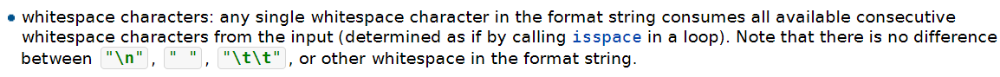

# 1-types-io

<small>最后更新于 {docsify-updated}。</small>

## scanf("\n")换行符匹配问题

<small>updated by 张哲恺	offered by 蚂蚁蚂蚁</small>

### 问题描述

为什么使用scanf("%d\n")后再使用scanf("%c")无法读入空格

### 解决思路

检索scanf("\n")的匹配行为，并动手实践验证

### 示例代码与解读

scanf("\n")的匹配行为是匹配接下来输入中的所有的空白符（包括空格和换行符），直到非空白符为止，因此输入流中数字后面的换行符以及接下来输入的空格均被scanf("\n")匹配（消耗），导致scanf("%c")无法读到输入的空格

```c
/*
输入为
9
 ILoveCPL
*/
int main(){
  char s[1005];
  int n;
	scanf("%d\n", &n); //scanf("\n")匹配掉了9后面的换行符\n和接下来的空格
  for(int i = 0; i < n; i++)
    	scanf("%c", &s[i]); //导致scanf("%c")无法读到空格
  //循环中只读到了8个字符，少于需要的9个字符，本地测试时导致程序阻塞在等待输入阶段
	printf("%s", s);
  return 0;
}
```

你可能会问：为什么要用scanf("%d\n")呢？

那么你不妨试试这样写：

```c
int main(){
  char s[1005];
  int n;
  scanf("%d", &n); //和上面的程序只有这里不一样
  for(int i = 0; i < n; i++)
    scanf("%c", &s[i]);
  printf("%s", s);
  return 0;
}
/*
使用上面的输入，你会得到的输出是

 ILoveCP
会发现输出在开始的位置多出了一个换行符，而末尾缺少了L
这是因为scanf("%c", &s[0])时匹配了输入流中的\n，导致最后的L没被匹配上
且第一个元素被存储为\n
*/
```

那么应该怎么解决呢？其实非常简单：

既然第二个程序的问题出在for循环中的第一次scanf("%c")匹配掉了换行符，那么我们在进入for循环之前提前scanf("%c")一下消耗掉换行符，问题就得到了解决

```c
int main(){
  char s[1005];
  char c;
  int n;
  scanf("%d", &n); 
  scanf("%c", &c);
  //和上面的程序只有这里不一样，用scanf("%c")消耗掉多余的换行符
  //值得指出scanf("%c")对一切字符都一视同仁，包括空白符（即空格，制表符和换行符）
  //你也可以使用getchar()函数
  for(int i = 0; i < n; i++)
    scanf("%c", &s[i]);
  printf("%s", s);
  return 0;
}
```

这样问题就得到了解决，不妨自己动手试一试

### 参考资料



https://en.cppreference.com/w/c/io/fscanf

录屏1-types-io应该也有提及