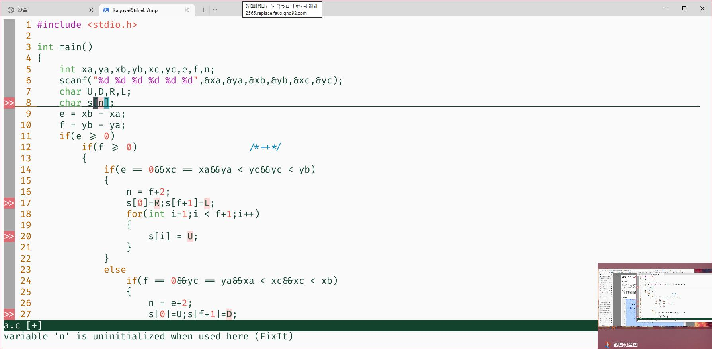
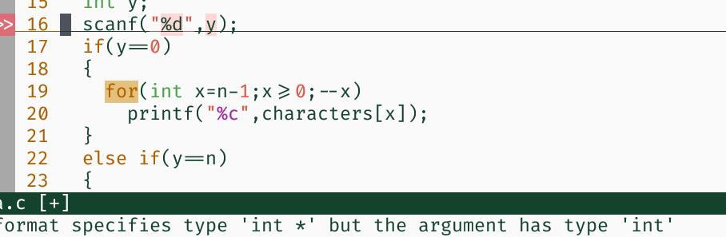
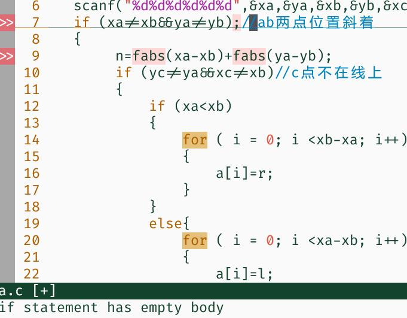
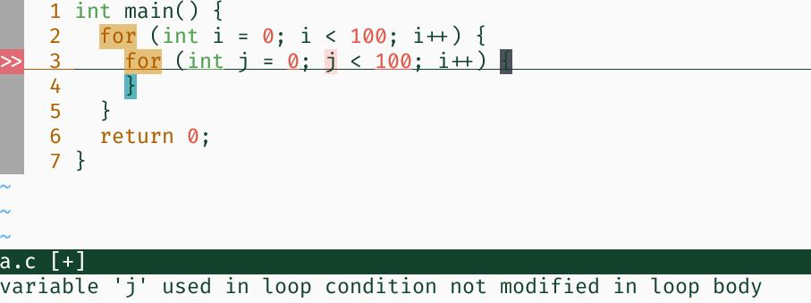
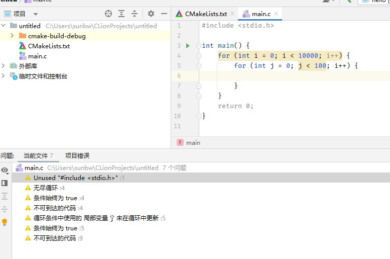
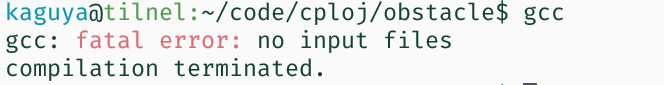
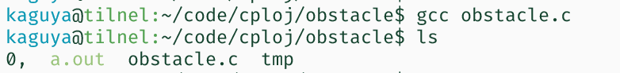
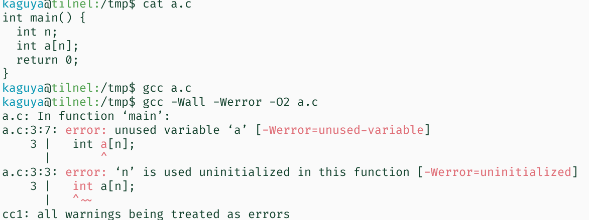
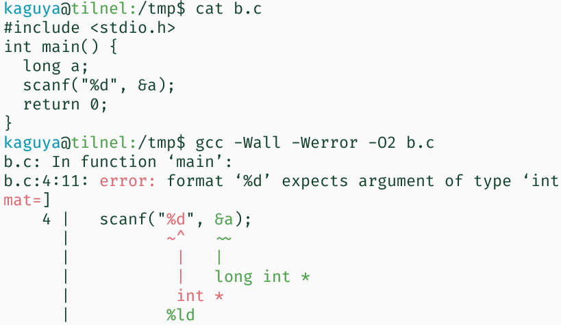

# DEBUGGING

<small>最后更新于 {docsify-updated}。</small>

[2022-10-20 19:00 如何调试 视频回放](https://box.nju.edu.cn/f/7f23bba0ced442b9ad16/)

每个人都经历过痛不欲生的 debug 环节，而下列做法往往是有问题的，看看你中枪了几个：

- 盯着代码死命看，看到哪里感觉不对劲就是找到了

- 就漫无目的地改改，改到对了就是成功

- 测试样例一遍一遍输，输错了就疯狂 <- <- <- <-。。。

- ~我样例都是对的...~

本节简单介绍一些经典的调试手段

## 摆正心态（编程哲学）

<center>机器永远是对的</center>

自己电脑上跑不起来了、OJ 上输出和自己电脑输出不一样了。。。最后都是你自己背锅。

- 嘿，其实你的代码里真的有错！

<center>未测代码永远都是错的</center>

- 你以为最不可能出 bug 的地方，往往 bug 就在那躺着

## 方法一：测试

> 问题只有暴露了你才能发现

这也就是为什么“盯着代码看是不好的”。因为盯着代码的时候，代码并没有在执行，不执行就不会出错。你就永远发现不了是哪个环节的问题。用我们的简单样例去测试你的程序是有必要的，但它仅能保证你的程序在非常有限的情况下是正确的。为了保证你的程序在所有可能的输入下都正确，你需要做充分的测试...

例如：第二周作业的 `obstacle`。我们一共有290个数据点，把大家折磨得痛不欲生。。。

就连助教想要测你的代码，都要用这么多测试。我们更应该想想，如何尽可能充分地测试自己的代码。


**难道我要花上一小时手动构造100个例子，然后再花一小时把它们一个一个输进去吗？**

当然不是！学计算机就是如此amazing...这种事完全可以编程实现：

```c
#include <stdio.h>
#include <stdlib.h>
#include <string.h>
// how to write test for your code?
// turn your main() function into a test() function, with input
// parameters.

char path[100];
int test(int xa, int xb, int xc, int ya, int yb, int yc) {
  memset(path, 0, 100);
  // 把你的路径保存到 path 里
  return 0;
}

int check(int a, int b, int c, int d, int e, int f, char *p) {
  int x = a, y = b;
  int len = strlen(p);
  for (int i = 0; i < len; i++) {
    switch (p[i]) {  // 目前可能没学到，这个 switch case 也可以用 4 个 if 来替代
    case 'U': y++; break;  // 按照你自己打出来的路径走一遍
    case 'D': y--; break;
    case 'L': x--; break;
    case 'R': x++; break;
    }
    if (x == e && y == f) { // 中途碰到障碍了，退出。。
      printf("fail on %d, %d, %d, %d, %d, %d, %s", a, b, c, d, e, f, p);
      exit(1);
    }
  }
  if (x != c || y != d) { // 没到终点
    printf("fail on %d, %d, %d, %d, %d, %d, %s", a, b, c, d, e, f, p);
    exit(1);
  }
  return 0;
}

int main() {
  // traverse 0, 0, 0...0 - 4, 4, ..., 4
  // enough for find your bug
  for (int a = 0; a < 5; a++)
    for (int b = 0; b < 5; b++)
      for (int c = 0; c < 5; c++)
        for (int d = 0; d < 5; d++)
          for (int e = 0; e < 5; e++)
            for (int f = 0; f < 5; f++) {
              if (a == c && b == d) continue;   // 跳过点重合的情况
              if ((a == e && b == f) || (c == e && d == f)) continue;
              test(a, b, c, d, e, f);
              check(a, b, c, d, e, f, path); // check if a, b can walk to c, d via path
            }
}
```

这下，我们可以在一秒内跑完 5^6 个测试，哪条路径打错了根本无处遁形...


## 方法二：工具救我！

举一些比较典的例子：





> 你肯定觉得，这种东西要是写代码的时候立马能提示你就好了




> 如果这个 if 再藏得深一点，加上后面有个注释，你可能一辈子都看不到后面有个分号。。。




> i 和 j 真的很像，盯着屏幕看真的会斗鸡眼吧


其实，clion 在这方面做的还是很不错的。本学期因为 clion 的普及，大家交上来的代码基本上都通过了 `clang -Wall -Werror -Wextra` 的分析。



> 有问题都已经指出来了

但是像 VSCode 可能你已经装了一些插件，但不管写出了多么糟糕的代码，它都不会有一点提示。

- 很不爽，对吧，但是一定有办法解决这件事
- 要么你转向其他的编辑器，CLion 开箱即用，Vim 只会花更多的时间配置，但相对地也会在工作中节省更多时间
- 要么就到网上搜怎么把 VSCode 配置完善（会花一些时间、遇到亿些问题）

Anyway，这些大家自己去完成，我的重点是：

- 利用工具替你完成编译时以及运行时检查

### 编译时检查

每个人都配了 gcc。。。



加个文件名，就能帮你生成 a.exe(a.out)



但这只是 gcc 的默认情况。我们还有附加的大礼包：

```sh
gcc -Wall -Werror -O2 -o obstacle obstacle.c
```

其中，

`-Wall` 表示启用编译器的所有警报消息

`-Werror` 表示如果有警报，就直接编译失败

`-O2` 表示开启 2 级编译优化。通常来说，这会暴露出你程序中更多的问题。。。

`-o` 后跟一个文件名，表示你要把程序编译成甚么名字

最后再指定你要编译的源代码文件名。

一行命令，能暴露出代码中很多不规范的地方。



又比如输入不规范：




**为什么要让 Warning 也通不过编译？只要没有 Error 就好了呀~**

- Warning 里就是有一些潜在的你没有考虑到的 bug。
- 对自己的代码负责，消除所有编译报错。。


不过 `gcc` 的分析能力还是有限。像循环条件 i, j 混淆分析不出来

<center>TO BE CONTINUED...</center>
