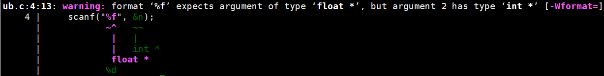

# Undefined Behaviors (UB)

<small>最后更新于 {docsify-updated}。</small>

?> [Undefined behavior @ cppreference.com](https://en.cppreference.com/w/cpp/language/ub)、[A Guide to Undefined Behavior in C and C++ (Part 1/2/3)](https://blog.regehr.org/archives/213) 与 [Undefined behavior @ wiki](https://en.wikipedia.org/wiki/Undefined_behavior)
总结了 C/C++ 中各类 Undefined Behaviors (UB)，并讨论了 UB 带来的好处与风险。 
**本页面按照课程进度总结学生将会遇到的各类 UBs。**

!> 代码中应避免出现任何 UBs!

## 什么是“未定义行为”?

“未定义行为”，字面意思就是未被定义的行为，接下来我们从两个方面来解释`未定义行为`

### 未定义

如同你所写下的每一行代码一样，编程语言的`编译器`（Compiler）也是由代码写就的；而编译器也如同你所使用的产品一样，面临着不断的迭代更新的问题。为了方便用户更好地学习使用这门不断发展的编程语言和编译器，也为了统一和记录各代编译器实现的共性与改变，编程语言会制定相应的`语言标准`，来规范编译器实现的功能。例如：[c++11 standard定义了编译器应如何实现\n的行为（p42）](https://www.open-std.org/jtc1/sc22/wg14/www/docs/n1548.pdf)

然而，为了兼容性和编译器对程序运行的优化考虑（具体内容可以参考最上方的三个链接），语言标准并不会强制定义所有编译器的实现

**未定义即是指这些没有被相应的语言标准所定义的程序段**

### 行为

由于这些程序段没有被语言标准定义其实现方式，它们**最终的执行结果就取决于编译器的不同实现**，没有对错之分

这里的没有对错之分指的是不同编译器得到的不同结果都是有道理的，而非在Online Judge上都应该是100分（

不妨想一想，如果你的代码中存在未定义行为，在你的电脑上运行出了期望中的结果，但是在配置了另外的编译器的另一台电脑上运行出的结果截然不同甚至导致了程序崩溃，是一件多么恐怖的事，因此：

> 代码中应避免出现任何 UBs!		——蚂蚁蚂蚁

这段话也解释了“为什么我的程序在本地运行正确，在oj上自定义测试跑相同的数据，出来的结果就完全不一样？”

而在众多的编程语言之中，C/C++囿于其“做尽可能少的限制，给予程序员尽可能大的权限（自由度），**充分相信程序员有理解并处理问题的能力**”的设计初衷，成功地以其“未定义行为”在初学者之中~~臭名昭著~~声名远扬。那么问题来了：

你值得被相信吗？

**如果暂时还不行，那也没关系**，下面我们将逐一分析大家现阶段可能会遇到的“未定义行为”，助你在值得被相信的道路上向前一步

## `scanf/printf` 中类型不匹配
### 描述

目前来说，这类未定义行为来源于转换说明符（`Conversion specifier`）中的格式说明符（`format specifier`），即scanf和printf函数格式串（`format string`）中的`%c`，`%d`，`%s`等

这种未定义行为又分为两小类：

#### 无效格式说明符

使用了未在规范中定义的格式说明符（见例1.1）

#### 格式说明符与变量类型不匹配

使用了不属于该变量类型的格式说明符来读入赋值/输出该变量（见例1.2）

这种未定义行为姑且有迹可循，因为在两种类型的数据存储可以相互理解时，大多数编译器的处理方式是将读入的数据按照格式说明符对应的变量类型解析为**二进制数据**，然后再将该二进制数据赋值给该变量，**但在该变量的数据解析模式下，其变量的值已经不再是程序员所期望的值**（见例1.3）

!> 即便有这样的规律，编程时也不应该使用！

但如果两种类型不可被相互理解时，其存储的值将无规律可循（见例1.4）

一般来说这种未定义行为会在编译时反馈警告，所以一定要特别注意编译器的反馈信息！

这里的反馈信息即在代码第4行处，`%f`期望一个为float类型的参数，但第二个参数的类型为int

### 示例

!> UB中示例下的代码均为错误示范！但你不妨试一逝（）

~~~~c
//eg 1.1
//使用未在规范中定义的格式说明符
#include<stdio.h>
int main(){
    char s[105] = "ilovecpl";
    scanf("%l", s);
    //%l是未在规范中定义的格式说明符，在gcc 12.2.0 (MingW) 下运行的结果是等待输入但忽略赋值，因为不清楚输入数据的解析方式
    //但是在gcc 9.4.0 (Ubuntu) 下运行的结果是忽略赋值语句，直接输出
    printf("%s", s);
    //输出ilovecpl
    scanf("%S", s);
    //%S是未在规范中定义的格式说明符，注意这里是大写的S，是比较常见的手误（雾）
    printf("%s", s);
    //这次gcc 12.2.0 (MingW) 的处理方式是只读入输入数据的第一个字符，比如如果我输入了metoo，最后输出的结果是m
    //而gcc 9.4.0 (Ubuntu) 的处理方式也是一致的
    return 0;
}
~~~~

值得说明的是`gcc 9.4.0 (Ubuntu)`不是oj评测机的配置，所以我不是在试毒（）

~~~~c
//eg 1.2
//使用了不属于该变量类型的格式说明符来读入赋值/输出该变量
#include<stdio.h>
int main(){
    double num;
    scanf("%f", &num);
    //这是非常常见的错误，需要记住读入时double的FS(format specifier)为%lf，%f是float的FS
    printf("%f", num);
    printf("%lf", num);
    //输出时double既可以使用%f作为FS，也可以使用%lf
    return 0;
}
~~~~

~~~~c
//eg 1.3
//有迹可循但绝对应该避免
int main(){
    int n;
    scanf("%f", &n);
    //使用%f读入int类型变量，如果我输入1，猜猜输出是什么
    printf("%d", n);
    //在前面提到的两种编译器下运行的结果一致
    //首先将1按照32位浮点数float的数据格式解析，其二进制表示为00111111100000000000000000000000 @计算系统基础
    //然后将该二进制数赋值给n，然后按照整数类型输出，进制转换后的结果为1065353216
    return 0;
}
~~~~

~~~~c
//eg 1.4
//无迹可寻，所以当你的程序输出了一些不断变化的值时不妨考虑一下
int main(){
    char s[105] = "ilovecpl";
    printf("%d", s);
    //使用%d格式输出字符串，你会发现每次运行输出的结果都不一样
    return 0;
}
~~~~

## 数字除以 0
### 描述

~~小学生都知道0是不能做除数的~~

但如果是在计算机中会发生怎样的事呢？

根据`IEEE 754`规定，浮点数（包括32位，64位和96位）除以0的结果可以是`nan`（Not A Number）或者`inf`（infinite）

具体结果到底是什么就取决于编译器的实现，不过不管它怎样实现你的程序都不会是正确的就是了…

而用整数除以0，运行结果也会比较丰富

### 示例

~~~~c
//eg 2.1
//整数除以0
int main(){
    int n;
    scanf("%d", &n);
    printf("%d", n/0);
    //在mingw gcc 12.2.0下输入结束后程序就无法运行自动退出
    //但是在ubuntu gcc 9.4.0下会反馈Floating point exception（浮点异常）
    return 0;
}
~~~~

~~~~c
//eg 2.2
//浮点数除以0
int main(){
    printf("%f", 10.0/0);
    //在前面的两种环境下运行结果均为inf
    return 0;
}
~~~~

## 访问未初始化的局部变量

### 描述

在FAQ的2-if-for-array对全局变量(`global variable`)和局部变量(`local variable`)的[简要介绍](http://47.122.3.40/#/faq/2-if-for-array)中，已经说明了局部变量不会被系统自动初始化的问题，因而未被初始化的局部变量中存储的是不确定的垃圾值，具体的说是上次使用这块内存后剩下的值，如果让垃圾值参与程序，程序的正确性就是不确定的，例如：

当你需要求出一个正数序列的最大值时，使用了一个未初始化的局部变量来保存最大值，如果这个局部变量的初始值碰巧为0或负数，那么程序运行的结果是正确的，但如果不巧初始值为比较大的正数，那么最后输出的“最大值”可能就是序列中未曾出现的一个值（见例3.1）

同样的，如果你要求一个序列的和，但使用未初始化的局部变量来保存序列的和，如果这个局部变量的初始值碰巧为0，那么你的程序运行结果才会是正确的，事实上，尤其是在评测姬上（由于评测姬需要运行的代码非常多，所以局部变量初始值为0的情况比较少见），这个情况的概率并不高（见例3.2）

!> 程序的正确性不应该依赖于特殊的实现，包括特殊的初始垃圾值

所以，在程序中使用局部变量时，除非在访问它前就会对它进行赋值，**一定要对它进行初始化**！

### 示例

~~~~c
//eg 3.1
//求正数序列最大值
#define N 5
int num[N] = {0, 1, 2, 3, 4};
int main(){
    int max_num;
    //本地真的很难测出来:(理解到意思就好
    //这里应该写成int max_num = 0;
    //或者在访问max_num前就对其进行赋值
    /*
    	int max_num;
    	max_num = 0;
    */
    for(int i = 0; i < N; i++){
        if(num[i] > max_num)
            max_num = num[i];
	}
    printf("%d", max_num);
    return 0;
}
~~~~

~~~~c
//eg 3.2
//数字序列求和
#define N 5
int num[N] = {0, 1, 2, 3, 4};
int main(){
    int sum;
    //同理
    for(int i = 0; i < N; i++){
        sum += num[i];
	}
    printf("%d", sum);
    return 0;
}
~~~~

## 数组访问越界
### 描述

数组在程序运行的过程中占用的是一块连续的内存，例如你写下的`int a[114514];`就是向系统申请了114514块连续的空间用来存储int类型的值，而你在代码中访问的`a[i]`实际上表示的是从a数组的首地址（a数组开始存储的位置即a[0]@计算系统基础）开始偏移i块内存空间，这样就能访问第i块内存空间上存储的值，而显然你所申请的数组空间不会抵达计算机内存的尽头，因此当你访问`a[114514]`时，就是从a[0]开始偏移114514块内存空间，虽然它并不在你申请的内存空间范围内，但你同样可以访问这块~~很臭的~~内存空间了

**但是由于你并没有向系统申请这块空间，所以系统不会帮你做初始化，因此这块空间上的值同样是垃圾值**（囿于全局变量的初始化方式，即使定义的是全局数组也还是垃圾值）

接下来会发生的事就和**访问未初始化的局部变量**非常类似了（见例4.1），但是由于系统的内存空间并非所有都允许访问，当你越界的行为太过分，系统判断可能受到攻击，出于保护自身会阻止你的访问，程序自动退出，在oj上表现为**运行错误**，也称为运行时错误，即Runtime Error（见例4.2）

不在编译层面上限制数组访问越界在C/C++语言中有相当的好处，同学们在课程后期**指针**的内容中**可能**就会明白一些

### 示例

~~~~c
//eg 4.1
//求正数序列最大值
#define N 5
int num[N] = {0, 1, 2, 3, 4};
int main(){
    int max_num = 0;
    //对局部变量初始化
    for(int i = 0; i <= 2*N; i++){
        //但是越界访问num[5]~num[10]
        if(num[i] > max_num)
            max_num = num[i];
	}
    printf("%d", max_num);
    //输出可能是垃圾值，如果不是你可以试着把2*N改得更大，但不要太大，见例4.2
    return 0;
}
~~~~

~~~~c
//eg 4.2
//还是求正数序列最大值
#define N 5
int num[N] = {0, 1, 2, 3, 4};
int main(){
    int max_num = 0;
    //对局部变量初始化
    for(int i = 0; i <= 10000*N; i++){
        printf("%d\n", i);
        //但是越界访问num[5]~num[50000]，越界太过分，自动退出
        //并且你会发现当你申请的数组空间一定时，允许越界的大小也是一定的
        if(num[i] > max_num)
            max_num = num[i];
	}
    printf("%d", max_num);
    return 0;
}
~~~~

## 表达式求值顺序

### 描述

在描述清楚这个未定义行为之前，我们需要先给出一些定义

#### 自增/自减

只是一些简化的写法，见下面的代码

~~~~c
i++;
++i;
//等价于i+=1;
i--;
--i;
//等价于i-=1;
~~~~

那么将自增/自减运算符放在变量之前和之后有什么区别？

将自增运算符写在变量之前表示在参与运算表达式之前自增，而写在变量之后表示在参与表达式之后自增

自减运算符同理

#### 序列点

序列点是程序代码中比较特殊的一些点，当序列点存在时，**必须先将序列点左边的表达式计算完毕后才能进行右边表达式的求值**；如果序列点不存在，那么表达式求值的顺序是**任意**的，不同的编译器通常具有不同的求值顺序

常见的序列点：

##### 程序语句分隔符

逗号`,`和分号`;`

因为程序语句是顺序执行的（goto被ban了），所以显然只有前一句语句执行完毕后才会执行下一句语句

##### 逻辑运算符

逻辑与运算`&&`和逻辑或运算`||`

因为两者有**短路执行**的特性，所以只有左边的逻辑表达式运算完毕后才会运算右边的逻辑表达式

什么是短路执行？在执行逻辑与运算时，只要左边的表达式为假，右边的表达式就不需要再计算；同样在执行逻辑或运算时，只要左边的表达式为真，右边的表达式就不需要再计算

##### 三目运算符

三目运算符`?`

显然只有三目运算符左侧的逻辑表达式运算完毕后才能决定执行右边的哪条语句

#### 为什么未定义

由于自增/自减运算符的运算顺序与表达式有关，当两个序列点之间只有一个表达式时，自增/自减运算的顺序是显然的；但如果两个序列点之间有多个表达式，**各个表达式执行的顺序又是任意的**，不同的编译器便又有了自己发挥的空间

比如当多个自增/自减表达式堆在两个序列点之间时

下面将结合实例进行解释

### 示例

~~~~c
int main(){
	int i = 1;
    printf("%d", ++i + i++);
	return 0;
}
~~~~

猜猜程序会输出什么？答案是5和4，解释是：

由于+不是序列点，所以它两侧的表达式和它自身的运算顺序是任意的

gcc认为：该语句的表达式的实际执行顺序应该为`i++;i += (++i);`，输出为5

microsoft vc++认为：出于程序运行优化考虑，该语句的表达式实际执行顺序应该为`(++i) + i; i++;`，输出为4

值得指出的是，给自增/自减表达式添加括号也不会改变所有编译器的理解方式，不妨试试下面的代码：

~~~~c
int main(){
    int i = 1;
    printf("%d", (++i) + (++i) + (++i));
    return 0;
}
~~~~

在gcc下，实际的执行顺序为`i++; i++; i + i + (++i);`输出为10

而在MS VC++下，实际的执行顺序为`i++; i++; i++; i + i + i;`输出为12

------

如果你对这些编译器的行为感到难以理解，那也没关系，你不需要理解甚至记忆怎么写这些语句会有怎样的执行顺序

**你只需要记住，不要写出这样的代码，否则会影响你和别人对代码的理解，代码的行为也是难以预测的**

具体地说，你需要注意**在两个序列点之间不要对同一个变量进行多次带有副作用的自增/自减运算**

## 其它参考资料
- [What Every C Programmer Should Know About Undefined Behavior #1/3](https://blog.llvm.org/2011/05/what-every-c-programmer-should-know.html)
- [Undefined Behavior and Fermat’s Last Theorem](https://web.archive.org/web/20201108094235/https://kukuruku.co/post/undefined-behavior-and-fermats-last-theorem/)
- [Undefined behavior can result in time travel (among other things, but time travel is the funkiest)](https://devblogs.microsoft.com/oldnewthing/20140627-00/?p=633)