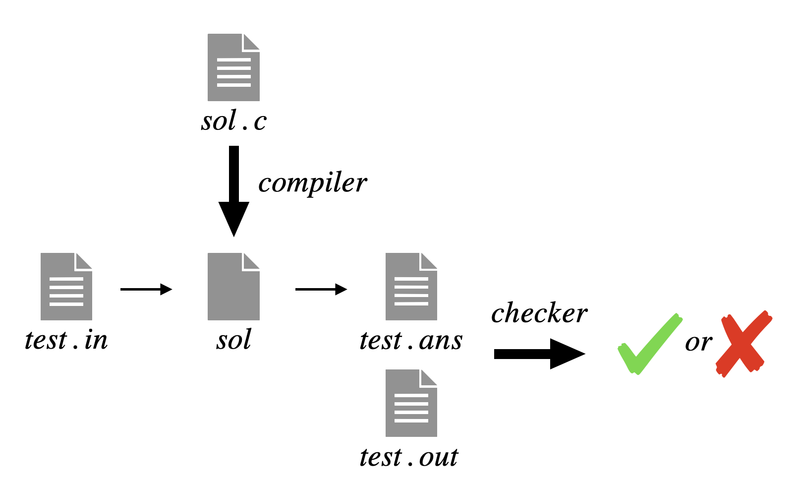

# 当你提交代码之后，OJ 到底做了什么？

<small>最后更新于 {docsify-updated}。</small>

> 为什么我在本地正常可以运行的代码，提交到 OJ 上之后就获得了 答案错误（时间超限 / 空间超限 / 运行错误 / ...... ）?

为了解答这个问题，需要了解 OJ 的原理。首先我们抛出一个终极问题：

### 怎样的代码是“正确”的？

这个问题没法回答，比如我们熟知的 `a + b Problem` ，绝大多数的代码都长这样。

```c
int main() {
  int a, b;
  scanf("%d%d", &a, &b);
  printf("%d\n", a + b);
}  
```

这个程序正确吗？得认为是正确的，几乎所有书上都是这么写的。对于绝大多数的“正常”输入，它都能给出正确的值。但考虑下面一组输入。

```plain
1234567890 9876543210
-1773790788
```

你可能会觉得我在耍赖，因为 `int` 本来就是有上限的。你可以把 `int` 想象成一个大小固定的、装水的杯子，而 `int` 的具体数值是装在里面的水。如果一个杯子里倒入了太多的水，水就会溢出来。这个现象称为溢出（overflow）。

这个例子想要说明的是

?> 没有永远正确的程序，所有的正确都是相对数据范围而言的。

实现一个 $0 \leq a, b \leq 10^9$ 的 `a + b Problem` 可能很简单，但实现一个 $0 \leq a, b \leq 10^{10000000}$ 的 `a + b Problem` 对大多数同学而言并不 trivial。

这时回头看一看我们的作业，其实所有**重要的数据范围**都已经在题目说明了。 **关注数据范围！** 这可能是在做 OJ 的过程中最重要的步骤之一。

回到开始的问题。当认识到程序的正确性和输入范围有关的时候，也就不难定义程序的正确性。依然以 $0 \leq a, b \leq 10^9$ 的 `a + b Problem` 为例，如果对于所有可能的输入 `a, b` ，程序都能输出正确的结果，那么就可以认为程序是正确的。

这个问题的输入空间是有限的，里面有接近 $10^{18}$ 个元素，如果把所有可能的输入都尝试一遍，就可以精确地判断程序在这个具体数据范围下的正确性。

### 退而求其次

很遗憾地告诉大家，这件事情在 2022 年是做不到的，因为输入空间已经大得超出了计算机能够承受的范围，于是我们只能退而求其次。

?>从输入空间中筛选出一些**有代表性的**的输入，然后测试程序在这些输入下是否正确。筛选出的数据就是 测试数据。如果程序在这些输入数据下全部都运行正确，那么就认为程序正确。

很显然这个方法是有缺陷的，就算程序通过了 OJ 的检验，也不能说它一定正确。但这种方法的准确性确实已经相当高了，这可能是因为我们写的程序是有“语义”的：为了解决某个具体的问题，只有少数几种常规方法，而测试完了这些方法上的易错点，程序正确的概率就大大提升了。

助教在出题的时候对于每一道题写好了几十组测试数据。每一组测试数据包含 标准输入 和 标准输出 两部分，即某个输入和对应的标准答案。你的解答（ `sol.c`）提交到 OJ 上之后，OJ 会把测试点的标准输入“喂”给你的程序 `./sol < test.in` 。`sol` 接受输入，产生输出 `test.ans` 。OJ 再将你的输出 `test.ans` 和 标准输出 `test.out` 进行比较，如果完全一样，就称通过了这一测试点。



类似的，如果你的输出和标准输出不一样，那就是“答案错误”；如果你的程序运行时间过长，那就是“时间超限”；如果你的程序在运行过程中发生了崩溃或不正常退出，那就是“运行错误”；……

如果一道题目总共含有 $10$ 个测试点，你的程序通过了其中的 $6$ 个，那么就拿到了 $60\%$ 的分数，这就是 答案错误 却有 $90$ 分的原因。

### 了解了这些，对我有什么用？

#### 严格遵守输出格式

OJ 在匹配答案的时候通常是全字匹配，并不会忽略你输出的多余信息，比如：

```plain
Please input a and b:
a + b = 3
```

而标准输出很可能是：

```plain
3
```

一个空格、一个回车都有可能会引起格式错误。

#### 别再问本地通过提交错误的问题了

一千个人写的程序就可能有一千个 bug ，不提供具体的代码，助教也不知道你为啥通不过。

#### 不要抱有侥幸心理

当你的程序被 OJ 拒绝（ reject ）的时候，一定是在某组具体的输入数据下发生了问题，换言之，**是你自己的问题而不是OJ的问题**，因此不要抱有“说不定是 OJ 抽风了”的侥幸心理并多次提交同样的代码，尤其是 时间超限 的代码。为了得出 时间超限 的结果，OJ 需要把所有的测试点全部运行（超时）一遍，挤占公共的评测资源是非常不道德的行为。

#### 我该怎么找 bug

不妨把自己带入写测试用例的助教视角，你会构造怎样的测试数据？

比如：

- 边界数据，比如当 `a` 和 `b` 非常大接近 $10^9$ 的时候和非常小接近 `0` 的时候。
- 大量随机数据，如果你的程序在大量的随机数据下均正确，那么它正确的概率会非常高。
- 可能会让你的程序 超时 / 运行错误 的数据。你的程序可能会死循环吗？会越界访问数组吗？数据类型会溢出吗？
- ……

最后希望大家做 OJ 的时候可以心平气和，好好找 bug ，尽量不要（用你的奇妙代码）折磨（可怜）助教。

